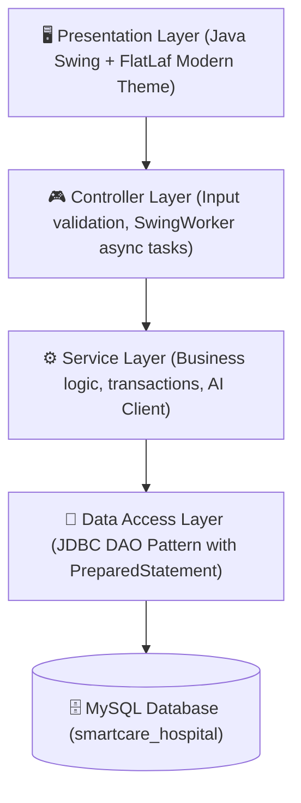

# SmartCare: AI-Enhanced Hospital Management System ⚕️🤖

[](https://openjdk.org/)
[](https://www.formdev.com/flatlaf/)
[](https://www.mysql.com/)
[](https://maven.apache.org/)
[](https://aistudio.google.com/)
[](LICENSE)

> A modern, robust, and AI-powered Hospital Management System built with **Core Java (Java 21)**, **Swing & FlatLaf UI**, **JDBC**, **MySQL**, and **Google Gemini AI**. Designed with clean multi-layered enterprise architecture for high reliability, responsiveness, and seamless clinical workflow management.

---

## 📌 Table of Contents
- [🌟 Key Features](#-key-features)
- [🏗️ System Architecture](#️-system-architecture)
- [🛠️ Technology Stack](#️-technology-stack)
- [🗄️ Database Design](#️-database-design)
- [🔐 Role-Based Access Control (RBAC)](#-role-based-access-control-rbac)
- [🤖 AI Clinical Copilot](#-ai-clinical-copilot)
- [🚀 Quick Start & Installation](#-quick-start--installation)
- [🔑 Default Demo Credentials](#-default-demo-credentials)
- [📁 Project Directory Structure](#-project-directory-structure)
- [📜 Academic / PBL Compliance](#-academic--pbl-compliance)
- [👨‍💻 Author](#-author)

---

## 🌟 Key Features

### 1. 🏥 Patient Management
- Comprehensive patient registration (Demographics, Blood Group, Emergency Contact, Medical History).
- Real-time search by Patient ID, Name, Phone, or Blood Group.
- Dynamic CRUD operations with validation and confirmation dialogs.

### 2. 👨‍⚕️ Doctor & Department Management
- Doctor profile registry mapped to departments (Cardiology, Neurology, Pediatrics, Orthopedics, General Medicine, etc.).
- Real-time availability toggling, consultation fee tracking, and contact management.

### 3. 📅 Appointment Scheduling
- Interactive appointment booking with instant doctor availability lookup.
- Lifecycle tracking: `SCHEDULED` ➔ `CONFIRMED` ➔ `IN_PROGRESS` ➔ `COMPLETED` / `CANCELLED` / `NO_SHOW`.
- Date filters and status badges for receptionists and doctors.

### 4. 📋 Electronic Medical Records (EMR) & Prescriptions
- Clinical consultation records with Chief Complaint, Diagnosis, and Treatment Plan.
- Integrated prescription manager with drug dosages, frequency, duration, and instructions.

### 5. 🛏️ Bed & Ward Management
- Hospital ward tracking (`ICU`, `GENERAL`, `PRIVATE`, `EMERGENCY`).
- Visual bed status badges (`AVAILABLE`, `OCCUPIED`, `MAINTENANCE`, `RESERVED`).
- Seamless patient admission and discharge workflows.

### 6. 💊 Pharmacy & Medicine Inventory
- Inventory management with unit price, stock balance, and expiry date monitoring.
- Automated **Low-Stock Alert** indicators when inventory dips below minimum thresholds.

### 7. 💳 Billing & Invoicing
- Itemized invoice generator covering consultation fees, room charges, pharmacy, and lab tests.
- Automated tax and discount calculations with multiple payment methods (`CASH`, `CARD`, `UPI`, `INSURANCE`).

### 8. 🤖 AI Clinical Copilot (Google Gemini 2.0)
- **Differential Diagnosis Assistance**: Analyzes symptoms and vital signs to suggest potential diagnoses.
- **Drug-Drug Interaction Checker**: Flags harmful pharmacological interactions in real time.
- **Discharge Summary Generator**: Drafts structured discharge summaries in seconds.

---

## 🏗️ System Architecture

SmartCare follows a strict **5-Tier Clean Layered Architecture**:



1. **Presentation Layer (`com.smartcare.ui`)**: Responsive Swing GUI enhanced with FlatLaf modern UI components, card layout navigation, and custom cell renderers.
2. **Controller Layer (`com.smartcare.controller`)**: Mediates UI events, manages asynchronous threading with `SwingWorker` to prevent UI freezing.
3. **Service Layer (`com.smartcare.service`)**: Core business rules, validation constraints, secure hashing, and AI API orchestration.
4. **Data Access Layer (`com.smartcare.dao`)**: Clean JDBC abstraction using `PreparedStatement`, transaction rollback management, and connection pooling.
5. **Database Layer**: Normalized MySQL relational schema (10 tables with foreign key constraints and indexes).

---

## 🛠️ Technology Stack

| Component | Technology | Description |
| :--- | :--- | :--- |
| **Language** | **Java 21 (LTS)** | Records, Switch Expressions, Virtual Threads ready |
| **GUI Framework** | **Java Swing + FlatLaf 3.5** | Modern, sleek, responsive light theme with rounded cards |
| **Database** | **MySQL 8.0+** | Relational storage with UTF8MB4 charset support |
| **Connectivity** | **JDBC (MySQL Connector/J 8.4)** | Secure parameterized queries preventing SQL injection |
| **AI Integration** | **Google Gemini 2.0 Flash API** | Built-in Java `HttpClient` + `Gson` |
| **Build Tool** | **Apache Maven 3.x** | Dependency and lifecycle management |
| **Security** | **PBKDF2 with SHA-256 + Salt** | Industry-standard password hashing |

---

## 🗄️ Database Design

The relational database `smartcare_hospital` comprises **10 normalized tables**:

```
smartcare_hospital
 ├── users              (Staff accounts, PBKDF2 hash, role, status)
 ├── departments        (Hospital departments & specializations)
 ├── doctors            (Doctor profiles, fees, room no, availability)
 ├── patients           (Patient demographics, blood group, emergency contact)
 ├── appointments       (Consultation schedules, tokens, status lifecycle)
 ├── medical_records    (Diagnoses, symptoms, vitals, clinical notes)
 ├── medicines          (Pharmacy inventory, stock thresholds, expiry)
 ├── prescriptions      (Prescription headers & itemized medications)
 ├── bills              (Invoices, tax, discounts, payment status)
 └── beds               (Ward allocations, room categories, occupancy)
```

---

## 🔐 Role-Based Access Control (RBAC)

SmartCare provides distinct dashboard views and granular permission controls based on the logged-in user's role:

| Role | Access Permissions |
| :--- | :--- |
| **ADMIN** | Full administrative access: Users, Doctors, Patients, Appointments, Billing, Analytics, Settings |
| **DOCTOR** | My Appointments, EMR, Prescriptions, AI Clinical Copilot, Patient History |
| **RECEPTIONIST** | Patient Registration, OPD Appointment Booking, Bed Allocation, Billing Desk |
| **PHARMACIST** | Medicine Inventory, Stock In/Out, Prescription Dispensing, Low Stock Alerts |
| **LAB_TECHNICIAN** | Lab Tests, Diagnostic Reports, Specimen Tracking |

---

## 🤖 AI Clinical Copilot

SmartCare integrates with **Google Gemini 2.0 Flash** via native Java `HttpClient`:

```
+-------------------------------------------------------------+
| SmartCare AI Clinical Copilot                               |
| [Input Patient Symptoms & Vitals]                           |
|  -> Async REST API Call (Google Gemini 2.0)                 |
|  -> Markdown/Plain text Clinical Insights & Safety Warnings |
+-------------------------------------------------------------+
```

To configure:
1. Obtain a free API key from [Google AI Studio](https://aistudio.google.com/app/apikey).
2. Add your key to [`db.properties`](file:///d:/New%20folder/Hospital%20management%20system/db.properties):
   ```properties
   ai.apiKey=YOUR_GEMINI_API_KEY
   ai.model=gemini-2.0-flash
   ai.enabled=true
   ```

---

## 🚀 Quick Start & Installation

### Prerequisites
- **Java Development Kit (JDK 21 or higher)**
- **MySQL Server 8.0+**
- **Maven 3.8+** (or IDE built-in Maven)

### 1. Clone the Repository
```bash
git clone https://github.com/Manishsah098/Hospital-Management-System.git
cd Hospital-Management-System
```

### 2. Configure Database Connection
Open `db.properties` in the project root and update your MySQL credentials:
```properties
db.url=jdbc:mysql://localhost:3306/smartcare_hospital?useSSL=false&allowPublicKeyRetrieval=true&serverTimezone=UTC
db.user=root
db.password=YOUR_MYSQL_PASSWORD
```

### 3. Initialize Database Schema & Seed Data
Choose either method:
- **Option A (One-Click Batch)**: Double-click `init_database.bat` and enter your MySQL password.
- **Option B (MySQL Workbench / CLI)**:
  ```bash
  mysql -u root -p < database/schema.sql
  ```

### 4. Build and Run

#### Method A: 1-Click Batch File (Windows)
Double-click [`run.bat`](file:///d:/New%20folder/Hospital%20management%20system/run.bat)

#### Method B: Maven Command Line
```bash
mvn clean package -DskipTests
java -jar target/smartcare-hospital-management-1.0.0-jar-with-dependencies.jar
```

#### Method C: Run via IDE (IntelliJ / Eclipse / VS Code)
Open the project in your IDE and run `com.smartcare.Main`.

---

## 🔑 Default Demo Credentials

Pre-seeded staff accounts with sample data for instant demonstration:

| Username | Password | Role | Designation |
| :--- | :--- | :--- | :--- |
| `admin` | `Admin@123` | **ADMIN** | Chief Hospital Administrator |
| `dr.sharma` | `Admin@123` | **DOCTOR** | Senior Cardiologist |
| `dr.patel` | `Admin@123` | **DOCTOR** | Consultant Neurologist |
| `receptionist1` | `Admin@123` | **RECEPTIONIST** | Front-Desk Executive |
| `pharmacist1` | `Admin@123` | **PHARMACIST** | Chief Pharmacist |
| `labtech1` | `Admin@123` | **LAB_TECHNICIAN** | Senior Lab Technician |

*(The login screen also includes a **"Quick Demo Login"** dropdown for 1-click test logins)*

---

## 📁 Project Directory Structure

```
Hospital-Management-System/
├── database/
│   └── schema.sql              # MySQL DDL & DML seed script (10 tables)
├── src/
│   ├── main/
│   │   ├── java/com/smartcare/
│   │   │   ├── ai/             # Gemini AI API Integration & Prompts
│   │   │   ├── controller/     # Controllers (Mediation & Validation)
│   │   │   ├── dao/            # Data Access Object Interfaces & JDBC Impls
│   │   │   ├── enums/          # Enumerations (UserRole, ApptStatus, BedType, etc.)
│   │   │   ├── exception/      # Custom Checked/Unchecked Exceptions
│   │   │   ├── model/          # POJO Domain Entities
│   │   │   ├── security/       # PBKDF2 Password Hasher & User Session Manager
│   │   │   ├── service/        # Service Layer Interfaces & Implementations
│   │   │   ├── ui/             # Swing UI Panels, Tables, Renderers, Dashboard
│   │   │   │   ├── dialog/     # Modal Dialogs (PatientDialog, DoctorDialog, etc.)
│   │   │   │   └── util/       # UI Helpers, Card Utilities, Colors
│   │   │   ├── util/           # DatabaseConnection, ConfigLoader, Validation
│   │   │   └── Main.java       # Application Entry Point
│   │   └── resources/
│   │       └── db.properties   # Classpath Default Configurations
│   └── test/java/              # Unit and Integration Tests
├── db.properties               # Local Configuration Override
├── init_database.bat           # Database Setup Script
├── run.bat                     # 1-Click Windows App Launcher
├── pom.xml                     # Maven POM Configuration
├── .gitignore                  # Git Ignore Rules
└── README.md                   # Project Documentation
```

---

## 📜 Academic / PBL Compliance

This project satisfies all requirements for **B.Tech Computer Science & Engineering Project-Based Learning (PBL)**:
- **Core Java & OOP**: Encapsulation, Inheritance, Polymorphism, Abstraction, Design Patterns (Singleton, Factory, DAO).
- **Relational DBMS**: 3NF Normalized Schema, Foreign Keys, Indexes, ACID Transactions.
- **Multithreading**: `SwingWorker` asynchronous threads for non-blocking UI during database and AI calls.
- **Exception Handling**: Hierarchical custom exception architecture (`DatabaseException`, `ValidationException`, `AuthenticationException`).
- **Modern AI Integration**: RESTful API integration using `java.net.http.HttpClient` with Google Gemini.

---

## 👨‍💻 Author

**Manish Sah**  
- GitHub: [@Manishsah098](https://github.com/Manishsah098)
- Project Repository: [Hospital-Management-System](https://github.com/Manishsah098/Hospital-Management-System)

---

⭐ *If you find this project useful, please consider giving the repository a star on GitHub!*
